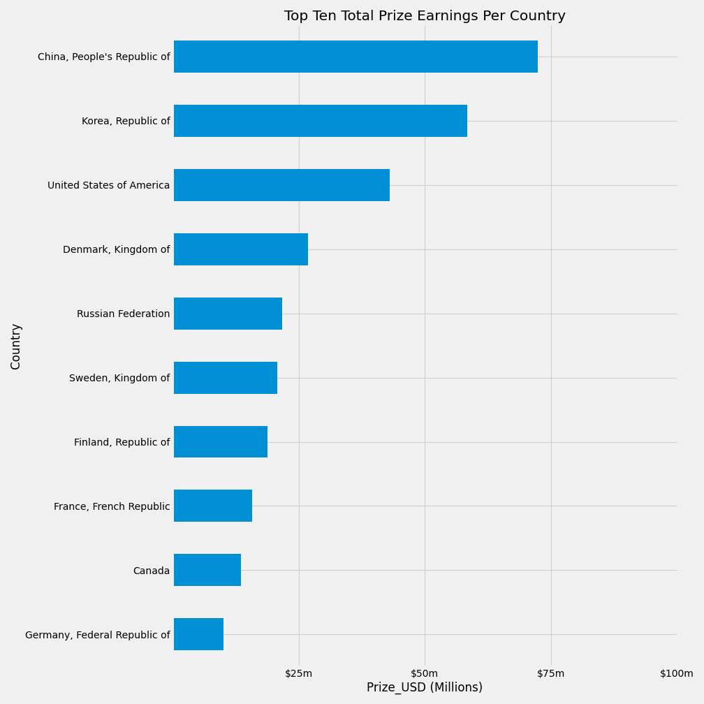

# Capstone 1: [eSports Winnings](https://www.kaggle.com/jackdaoud/esports-earnings-for-players-teams-by-game)

### Dataset

This data was pulled from [eSportsEarning.com](https://www.esportsearnings.com/) and has info for players and teams in different tournaments.

### Visualizations

* Prize share between games:

* Average team prize per game:

* Average player prize per game:

* Showing price per tournament grouped by genre:

* Split out prize per player for games by genre:

* Prize totals per country:

* Prize averages per country:

### Possible Hypothesis

* First-Person Shooters pay more per player
* It makes more sense for someone to compete in games that do not have teams, or have small teams

### To-do's:

* Maybe scrape more from site for comparisons
