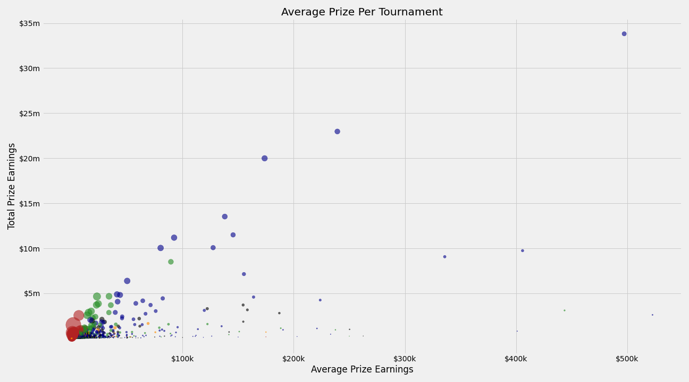
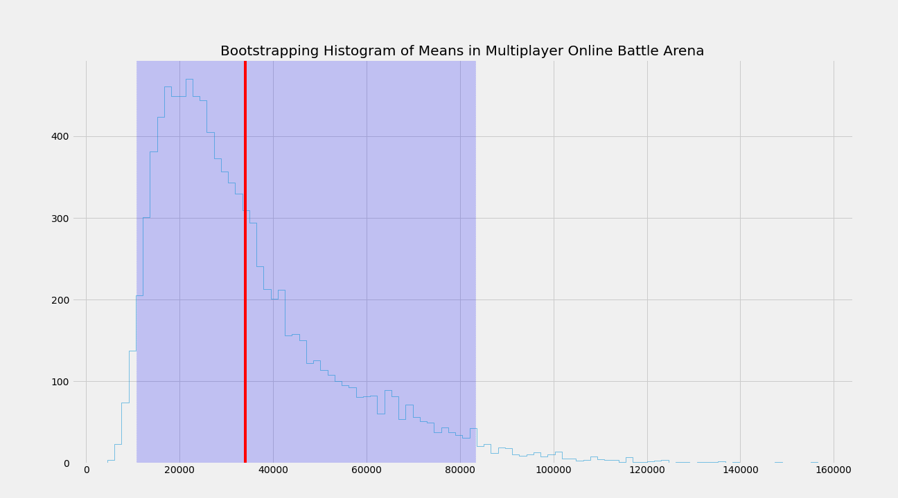
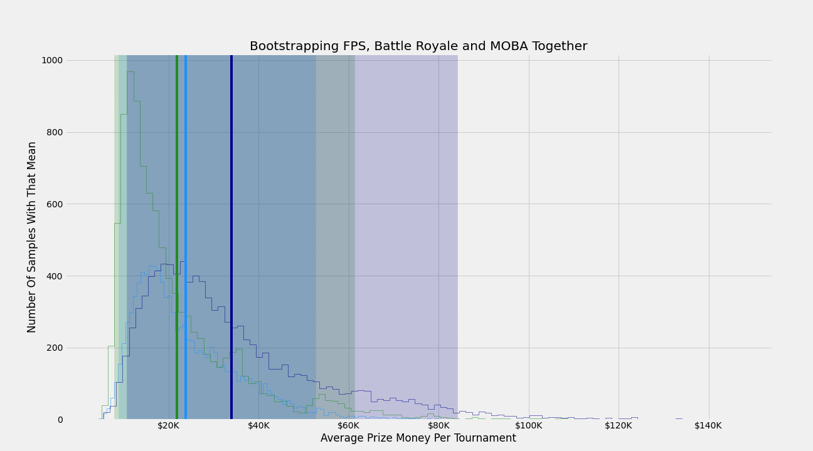

# Capstone 1: [eSports Winnings](https://www.kaggle.com/jackdaoud/esports-earnings-for-players-teams-by-game)

## Dataset

This dataset consists of eSports earnings of 10 different major eSports titles, with 3 different files (Team data, Player data & Country data). The information was pulled from [eSportsEarning.com](https://www.esportsearnings.com/) and has a lot more records on the site itself than are actually used in here.

### Struggles with Dataset:

* No way to link the Teams df with the other df's

* Teams df doesn't include a count of players splitting the earnings

* Would have liked to have more eSports titles included

### Games & Genres included:

    Games:                                  Genres:
    Dota 2                                  Multiplayer Online Battle Arena (MOBA)
    Counter-Strike: Global Offensive        First-Person Shooter (FPS)
    Fortnite                                Battle Royale
    Hearthstone                             Collectible Card Game
    Starcraft II                            Strategy
    Overwatch
    PUBG
    League of Legends
    Heroes of the Storm
    Arena of Valor

## Getting to know the data:

* Showing price per tournament grouped by genre:

* Showing the share of number of tournaments played and winning per tournament:

* Showing Average team earnings in comparison to their total earnings (Size of bubble indicates the amount of tournaments that the team has played in for that game)

## Hypothesis

* First-Person Shooters are the best genre for earning money in any given tournament

    * Explored through bootstrapping all genres data individually 10,000 times, using each teams take home money per tournament:

This of course paled in comparison to the Multiplayer Online Battle Arena genre

    FPS Lower & Upper 95%:              FPS Mean:
    ($7,982.36, $59,928.36)                 $21,830.92
    
    MOBA Lower & Upper 95%:             MOBA Mean:
    ($10,686.20, $83,250.52)                $33,833.43

If we plot them both together:

## Interesting notes:

* First-Person Shooters and Strategy games were the only genres with a negative correlation between the amount of tournaments played and prize money taken home

* Prize totals per country:

* Prize averages per country:

## Would have liked to do:

* Scrape site for more data
    * What games certain teams focus on
    * Does allocating time and energy to a specific game or genre have a significant impact on prize earnings

## References:

* Site that holds all this information typically --> https://www.esportsearnings.com/
