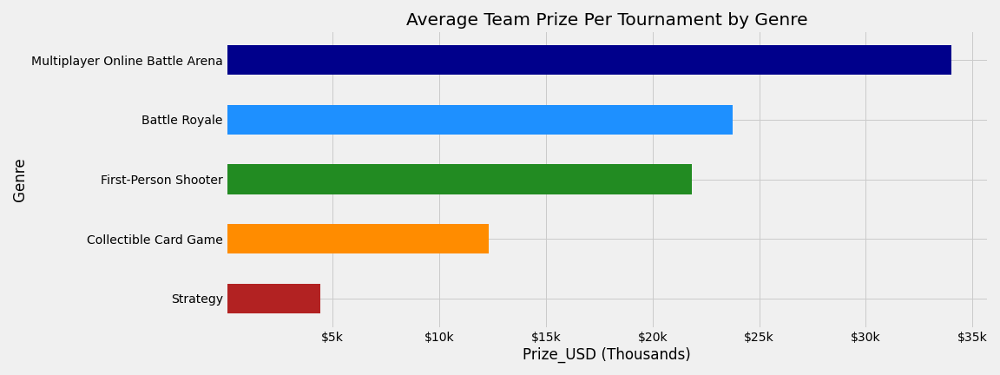
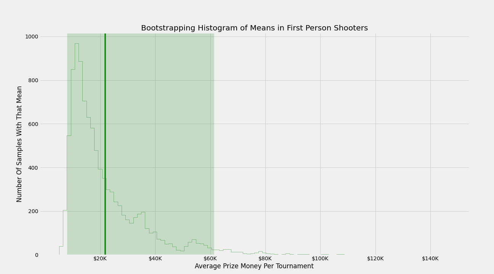

# Capstone 1: [eSports Winnings](https://www.kaggle.com/jackdaoud/esports-earnings-for-players-teams-by-game)

## Dataset

This dataset consists of eSports earnings of 10 different major eSports titles, with 3 different files (Team data, Player data & Country data). The information was pulled from [eSportsEarning.com](https://www.esportsearnings.com/) and has a lot more records on the site itself than are actually used in here.

### Struggles with Dataset:

* No way to link the Teams df with the other df's

* Teams df doesn't include a count of players splitting the earnings

* Would have liked to have more eSports titles included

### Games & Genres included:

    Games:                                  Genres:
    Dota 2                                  Multiplayer Online Battle Arena (MOBA)
    Counter-Strike: Global Offensive        First-Person Shooter (FPS)
    Fortnite                                Battle Royale
    Hearthstone                             Collectible Card Game
    Starcraft II                            Strategy
    Overwatch
    PUBG
    League of Legends
    Heroes of the Storm
    Arena of Valor

## Getting to know the data:

* Showing price per tournament grouped by genre:

* Showing the share of number of tournaments played and winning per tournament:

* Showing Average team earnings in comparison to their total earnings (Size of bubble indicates the amount of tournaments that the team has played in for that game)

## Hypothesis

* Null: First-Person Shooters **are not** going to yield significantly more earnings on average compared to other genres
* Alternative: First-Person Shooters **are** going to yield significantly more earnings on average compared to other genres

Explored through bootstrapping all genres data individually 10,000 times, using each teams take home money per tournament:

Based on the bootstrapping samples we fail to reject the null hypothesis, Battle Royale & MOBA make more on average:

    FPS Lower & Upper 95%:              FPS Mean:
    ($7,982.36, $59,928.36)             $21,830.92
    
    Battle Royale upper & lower:        Battle Royale Mean:
    ($8,998.19, $52,521.23)             $23,797.73

    MOBA Lower & Upper 95%:             MOBA Mean:
    ($10,686.20, $83,250.52)            $33,833.43

If we plot them both together:

The rest of the bootstrapping numbers:
    
    Card Games upper & lower:           Card Game Mean:
    ($2,990.66, $30,841.32)             $12,276.47

    Strategy upper & lower:             Strategy Mean:
    ($1,406.12, $20,543.00)             $4,492.51

## Would have liked to do:

* Scrape site for more data
    * What games certain teams focus on
    * Does allocating time and energy to a specific game or genre have a significant impact on prize earnings

## References:

* Site that holds all this information typically --> https://www.esportsearnings.com/